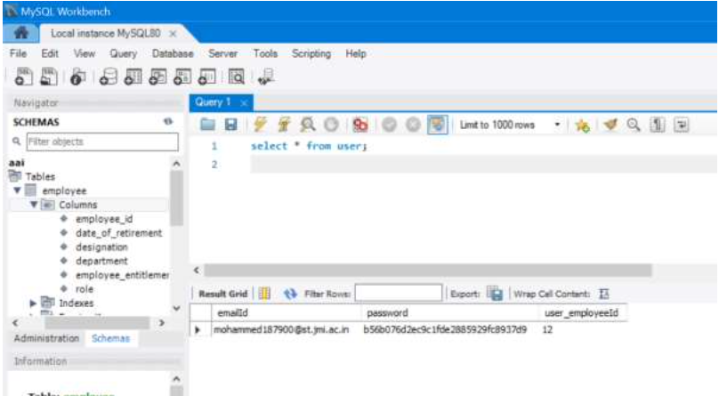
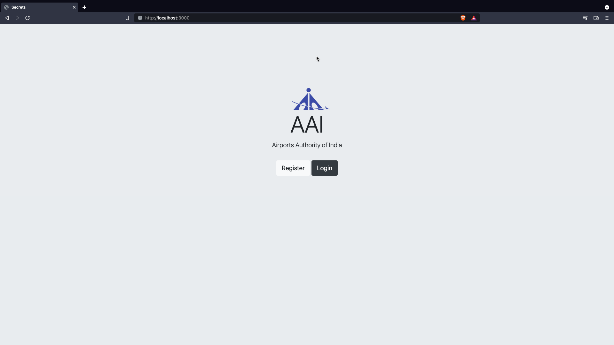
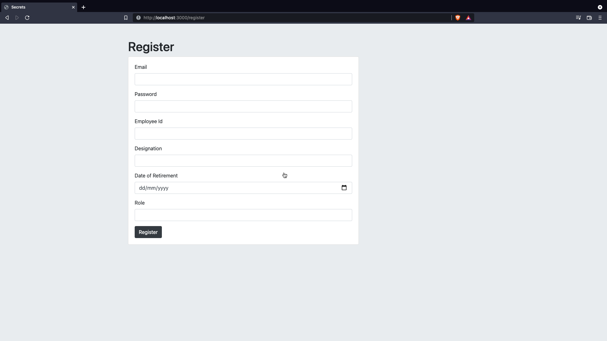
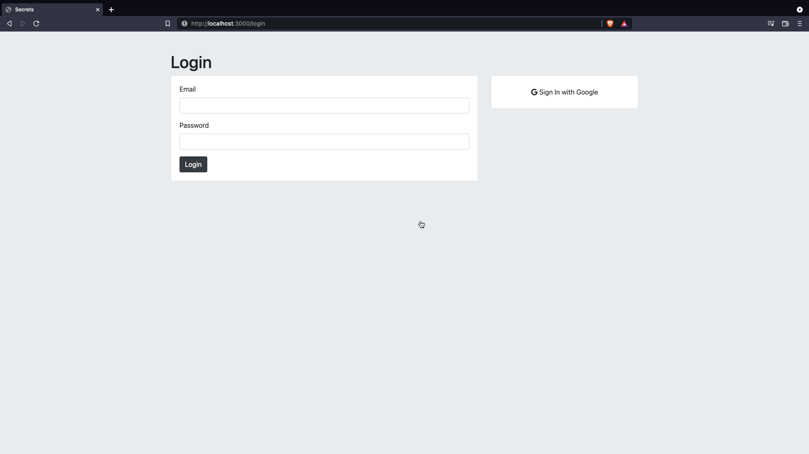
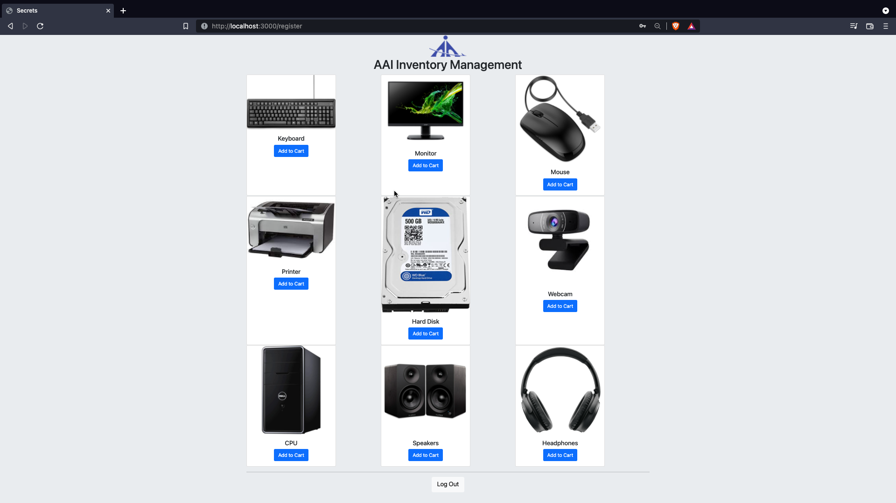

## 🚀 I am Abhishek Chand 👋
I am a final year engineering student at Jamia Millia Islamia. I'm a budding data analyst and keenly interested in the field of data analysis.

## Introduction
The Airports Authority of India or AAI is a statutory body, under the ownership of Directorate General of Civil Aviation, Ministry of Civil Aviation, Government of India. It is responsible for creating, upgrading, maintaining and managing civil aviation infrastructure.
## AAI Inventory Management Database
I worked on this project during my internship at AAI. The aim of this project was to provide a SQL Database for AAI's inventory management portal.

## Database Schema

- ## Employee Table
    - Employee id
    - Date of retirement
    -  Name
    -   Designation
    - Department
    - Employee entitlement
    - Role

- ## User Table
   - Email Id
   - Password
   - Employee Id (Foreign Key References to Employee Table)

    
## Documentation

The project uses a SQL database which gaurantees ACID properties and the front end is developed using HTML, CSS and JavaScript.

## Security Through Md5 Encryption
The security of user password is ensured through Md5 Encryption.
The password is stored in database in encrypted form ensuring that user's safety is upheld.

## Screenshots of Web Portal 

